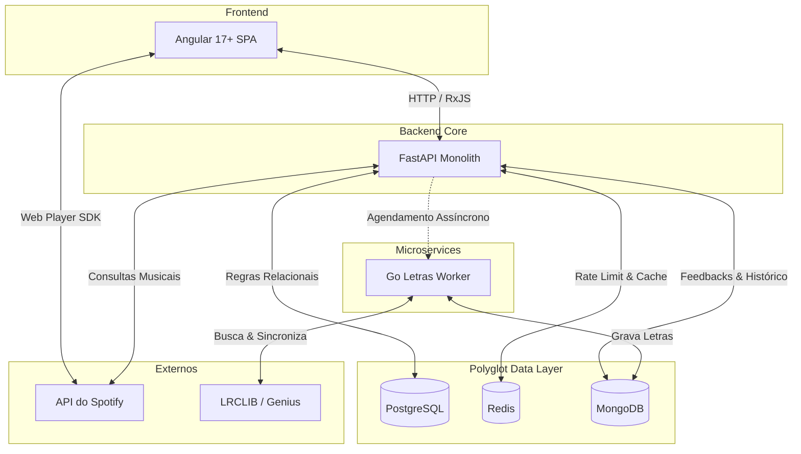

# 🎵 Tunify Ecosystem

  
  
  
  
  
  

 

O **Tunify** é muito mais que um player alternativo. Trata-se de uma plataforma avançada de **Engenharia Musical** e curadoria algorítmica que estende e subverte as capacidades nativas do ecossistema Spotify. 

> *"Como um apaixonado por música e fã absoluto do Spotify, minha jornada na programação tomou um novo rumo quando descobri a API oficial da plataforma. Perceber que eu poderia ter acesso aos 'bastidores' matemáticos de cada faixa foi um divisor de águas. O Tunify nasceu desse fascínio: um laboratório pessoal criado para ir além do que o app oficial oferece, construindo soluções inéditas e transformando minha paixão musical em engenharia de software."* — **Athos Inácio, Criador do Tunify**

Enquanto os algoritmos tradicionais de streaming mantêm o usuário em "bolhas" baseadas em popularidade, o Tunify empodera você a atuar como um engenheiro do próprio som. Utilizando **Ciência de Dados (Data Science)**, **Modelagem Matemática de Áudio** e **Teoria dos Grafos**, o sistema traduz abstrações como "Alegria" ou "Melancolia" em vetores exatos (Valência, Energia, Acústica e Tempo).

---

## 🏛️ Arquitetura e Persistência Poliglota

O Tunify foi desenhado como um ecossistema robusto, capaz de lidar com altas volumetrias de dados musicais (Data Lake) sem gargalos. Para isso, aplicamos o conceito de **Persistência Poliglota**, utilizando três motores de banco de dados diferentes, cada um resolvendo um problema específico na nossa arquitetura:

1. **PostgreSQL (O Núcleo Relacional):** Garante a integridade absoluta. Armazena usuários, vínculos de autenticação, dicionários de *Audio Features* cacheados (o "DNA" de 1 milhão de músicas) e o histórico de gerações.
2. **MongoDB (A Flexibilidade de Documentos):** Um banco *Schema-less* ideal para a nossa caixa de entrada de "Transmissões Diretas" (feedbacks) e, crucialmente, para armazenar o gigantesco e imprevisível volume de texto das Letras de Música geradas pelo nosso microserviço.
3. **Redis (A Memória Flash):** Atua como cache em memória ultrarrápido para controlar o *Rate Limit* (evitando que o Spotify bloqueie o app) e armazenar metadados temporários que não precisam poluir os bancos principais.

### Fluxo da Arquitetura do Sistema

---

## 🚀 A Evolução: Microserviço em Go

Com a necessidade de oferecer uma experiência imersiva com **letras sincronizadas em tempo real (Karaokê)**, esbarramos no custo de I/O de fazer *web scraping*. Para não comprometer a altíssima velocidade do algoritmo principal em Python, nasceu o **[Tunify Letras Microservice](https://github.com/athosdanilo/tunify-letras)**. 

Este *worker* independente foi escrito em **Go (Golang)** por sua extrema concorrência (*Goroutines*). Ele atua como um robô silencioso: quando uma música inédita é descoberta no Tunify, a música é posta em uma fila. O robô em Go acorda, busca a letra com sincronização de tempo, faz *scraping* como fallback e injeta os dados no MongoDB. O Angular não espera, a latência do app se mantém em zero, e no próximo play de qualquer usuário, a letra salta na tela em menos de 10 milissegundos.

---

## ✨ Funcionalidades em Destaque

O Tunify é dividido em módulos analíticos e de descoberta que vão muito além de simplesmente tocar músicas:

* 🎛️ **Vibe Architect & Modo Caos:** Desenhe o gráfico da energia da sua playlist (ex: começar calmo e terminar num pico de euforia). Se quiser emoções fortes, ative o *Modo Caos*, e o algoritmo injetará faixas com contrastes vetoriais absolutos criando uma "montanha-russa matemática".
* 🧬 **Dashboard Analítico (DNA Musical):** Um painel completo com "Spider Charts" (Gráficos de Radar) que compara os 5 atributos da sua vibe média com a média global, além de rastrear as horas de escuta mensais exatas do usuário através de rotinas agressivas de *Downsampling*.
* 🎧 **Mixagem Harmônica (Camelot Wheel):** Transições perfeitas. O algoritmo garante que a ponte entre as músicas respeite a compatibilidade de Tonalidade (Key/Mode), evitando aquele choque sonoro ao pular de faixa.
* 🕹️ **Sistema de Selos (Gamificação):** O seu tempo vale troféus. Rotinas automáticas cruzam seu uso com a plataforma, liberando selos na sua "Vitrine" de perfil, como *Fã Mensal do Artista*, *Clube dos 10.000 Minutos* (Permanente) ou *Fã do Ano*.
* 🔗 **Tunify Sync (Match de Vibe):** Geração de convites P2P para sincronizar com contas de amigos. O painel compara a afinidade matemática entre os dois, gera uma porcentagem de compatibilidade e possibilita criar uma playlist de "Interseção" (agradando os dois) ou "Colisão" (intercalando opostos).
* 🧹 **Library Cleaner:** Scanner avançado que varre sua biblioteca atrás de músicas "Fantasmas" ou duplicatas de álbuns diferentes, permitindo limpar sua conta com um clique.

---

## 🧪 Qualidade de Software e Testes Automatizados

O Tunify implementa a estratégia da Pirâmide de Testes para garantir a estabilidade do ecossistema, prevenindo regressões nas complexas fórmulas matemáticas e assegurando uma experiência fluida.

### Frontend (Angular + Vitest)
* **Vitest & Testing Library:** Modernizamos a suíte padrão do Angular migrando para o **Vitest**, garantindo velocidade extrema na execução. O foco recai no isolamento dos componentes UI e no teste dos fluxos assíncronos e reativos (*RxJS / Signals*).
* **Testes E2E (End-to-End):** Automação de fluxos críticos no navegador real, assegurando a confiabilidade de jornadas como: Autenticação OAuth, renderização dos "Spider Charts" no Dashboard e a construção vetorial no Vibe Architect.

### Backend Core (Python + Pytest)
* **Pytest & TestClient:** Cobertura rigorosa sobre a matemática do sistema. Testes unitários validam a exatidão das Fórmulas Euclidianas, a correta interpolação de energia das playlists e a precisão da conversão tonal na *Camelot Wheel*.
* **Resiliência e Mocks:** Testes de integração pesados utilizando simulação (*mocking*) da API do Spotify. O objetivo é garantir o acionamento do *Circuit Breaker* interno quando a plataforma externa sofre quedas ou envia bloqueios de tráfego (Rate Limits).

---

## 📄 Licença

Copyright (c) 2026 Athos Inácio

All Rights Reserved.

Este projeto e seu código-fonte são propriedade exclusiva do autor. Não é concedida permissão para usar, copiar, modificar, distribuir, sublicenciar ou vender qualquer parte deste software sem autorização prévia e por escrito. 

O projeto é disponibilizado publicamente apenas para fins de portfólio e demonstração técnica da capacidade de orquestração entre Frontend, APIs de *Data Science* e Microsserviços assíncronos em um ecossistema robusto.

---

  <b>Desenvolvido por ATHOS INÁCIO</b>

