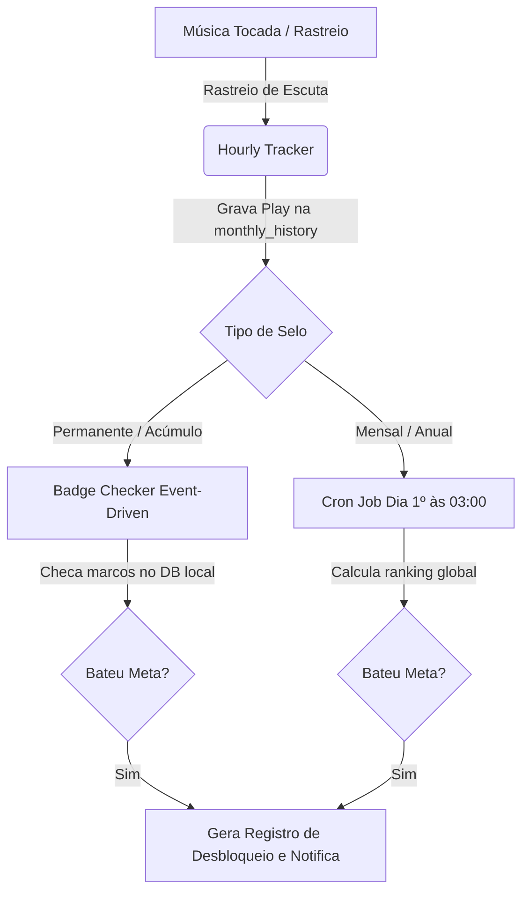

# Planejamento Técnico: Sistema de Selos e Conquistas (Trophy Room)

Este documento atua como o mapa oficial de design do sistema de gamificação do **Tunify**. Aqui são registradas as decisões de arquitetura, banco de dados, fluxo de dados, lógica do motor de verificação e interface do usuário para a funcionalidade de Selos e Conquistas.

---

## 1. Visão Geral & Contexto no Tunify

O sistema de selos visa engajar o usuário na exploração de músicas, acompanhamento de hábitos de áudio e criação de uma identidade musical compartilhável. Ele se conecta diretamente aos dados de escuta do usuário (calculados pelo *Hourly Tracker*) e se torna um elemento central de personalização exibido no **Tunify Sync (Match de Vibe)** e no compartilhamento social.

### 1.1. Decisão de Persistência: PostgreSQL
Seguindo as diretrizes de arquitetura poliglota do Tunify, o sistema de selos será armazenado e gerenciado no **PostgreSQL**. A escolha baseia-se em:
* **Integridade Referencial**: Uso de chaves estrangeiras rígidas relacionando o inventário do usuário (`user_selos`) ao catálogo (`selos_catalog`) e aos usuários (`users`), eliminando dados órfãos.
* **Consultas Performáticas (JOINs)**: Hidratação rápida e eficiente do Trophy Room através de junções relacionais indexadas na API do Dashboard.
* **Validação de Unicidade**: Uso de restrição única composta (`UNIQUE(user_id, selo_id, reference_period)`) para evitar conquistas duplicadas.
* **Validação de Negócio (Pins)**: Facilidade em validar e limitar a contagem de selos destacados (máximo de 3) antes de realizar atualizações no banco.

---

## 2. Estrutura de Dados, Temporalidades e Legados

Os selos do Tunify são classificados e gerenciados de acordo com sua validade temporal e lógica de persistência. A modelagem no banco de dados deve refletir e suportar o histórico do usuário.

### 2.1. Tabela de Categorias Temporais

| Categoria | Tipo de Atualização | Descrição / Exemplo | Comportamento no Inventário | Lógica de Armazenamento |
| :--- | :--- | :--- | :--- | :--- |
| **Mensais** | Lote (Mensal) | *"Top 1% Ouvinte de Billie Eilish em Maio"* | Histórico. Vira "selo legado" após o término do mês. | Registro fixo por período (`reference_period` = `"YYYY-MM"`). |
| **Anuais** | Lote (Anual) | *"Audiófilo Destaque de 2025"* | Histórico / Permanente. Registro permanente do ano conquistado. | Registro fixo por período (`reference_period` = `"YYYY"`). |
| **Permanentes** | Orientado a Eventos | *"Explorador: Descobriu 500 artistas novos"* | Permanente e acumulativo. Desbloqueado e mantido vitaliciamente. | Registro único sem período específico (`reference_period` = `NULL`). |

> [!NOTE]
> **Regra de Acúmulo Vitalício dos Selos Permanentes:** 
> A verificação de selos da categoria **Permanentes** sempre utilizará a **soma histórica vitalícia agregada** de todos os dados do usuário. Por exemplo: se um usuário ouviu 6.000 minutos no primeiro mês e 6.000 minutos no segundo mês, o total histórico acumulado é de 12.000 minutos. O motor concederá automaticamente o selo de 10.000 minutos ouvidos. A conquista não expira e permanece com o usuário por toda a vida da conta.

### 2.2. Modelagem de Períodos e Regra de Unicidade
* **Coluna `reference_period`:** Na tabela `user_selos`, o campo `reference_period` (do tipo VARCHAR ou DATE) armazenará o intervalo de tempo correspondente à conquista:
  - Selos Permanentes: `NULL`
  - Selos Mensais: `"YYYY-MM"` (ex: `"2026-05"`)
  - Selos Anuais: `"YYYY"` (ex: `"2026"`)
* **Chave Única Composta (`UNIQUE(user_id, selo_id, reference_period)`)**: Esta restrição no PostgreSQL garante que um usuário não receba o mesmo selo mais de uma vez para o mesmo período de referência (por exemplo, dois selos iguais de "Top 1% Ouvinte de Billie Eilish" em `"2026-05"`).
* **Por que essa modelagem?** Ela permite diferenciar selos mensais recorrentes obtidos em meses diferentes. Se o usuário for o "Top 1% de Billie Eilish" em maio de 2026 e também em junho de 2026, ele terá dois registros no inventário (`user_selos`), permitindo mapear o histórico e a recorrência das conquistas.

### 2.3. Lógica de "Selos Legados" (Meses Anteriores)
Para manter o engajamento e a sensação de progressão do usuário, os selos temporais de meses passados **não são excluídos ou desativados**, mas sim transformados em **selos legados (históricos)**.
* **Comportamento Visual na Galeria:** 
  - Selos do mês corrente ou selos permanentes são exibidos com suas cores vibrantes originais.
  - Selos de meses anteriores (legados) recebem uma alteração visual para indicar explicitamente que pertencem ao passado: eles mudam de cor (ex: uma tonalidade levemente dessaturada, efeito de bronzeado ou borda de platina fosca) e recebem um rótulo textual em destaque indicando o período (ex: `"MAIO / 2026"`).
* **Por que manter como legado em vez de rotacionar/apagar?** Apagar o selo faria o usuário sentir que seu esforço anterior foi descartado. Transformá-lo em um legado visualmente distinto valoriza o engajamento passado, servindo como uma "linha do tempo" da jornada musical do usuário.

### 2.4. Modelagem Física das Tabelas (PostgreSQL)
Abaixo está o esquema físico (DDL) proposto para implementação no banco de dados do Tunify:

```sql
-- Catálogo oficial de selos disponíveis no sistema
CREATE TABLE selos_catalog (
    id SERIAL PRIMARY KEY,
    name VARCHAR(150) NOT NULL,
    description TEXT NOT NULL,
    badge_type VARCHAR(50) NOT NULL, -- 'permanent', 'monthly', 'yearly'
    icon_path VARCHAR(255) NOT NULL, -- Caminho local do asset ou URL
    criteria_type VARCHAR(100) NOT NULL, -- Ex: 'distinct_genres', 'minutes_played', 'artist_loyalty'
    criteria_value INTEGER NOT NULL, -- Limite numérico de ativação da regra
    created_at TIMESTAMP WITH TIME ZONE DEFAULT CURRENT_TIMESTAMP
);

-- Inventário de selos conquistados pelos usuários
CREATE TABLE user_selos (
    id SERIAL PRIMARY KEY,
    user_id INTEGER NOT NULL REFERENCES users(id) ON DELETE CASCADE,
    selo_id INTEGER NOT NULL REFERENCES selos_catalog(id) ON DELETE CASCADE,
    unlocked_at TIMESTAMP WITH TIME ZONE DEFAULT CURRENT_TIMESTAMP,
    reference_period VARCHAR(7), -- NULL (para permanentes), 'YYYY-MM' (mensais), 'YYYY' (anuais)
    is_pinned BOOLEAN DEFAULT FALSE,
    notified BOOLEAN DEFAULT FALSE,
    CONSTRAINT unique_user_selo_period UNIQUE (user_id, selo_id, reference_period)
);

-- Índices adicionais para otimização de consultas e ordenação na vitrine
CREATE INDEX idx_user_selos_user_id ON user_selos(user_id);
CREATE INDEX idx_user_selos_pinned ON user_selos(user_id) WHERE is_pinned = TRUE;
```

### 2.5. Catálogo Inicial de Selos Planejados
Para o lançamento inicial e validação da feature, definimos o seguinte conjunto de selos:

#### Selos Permanentes (Desbloqueio Event-Driven)
* **Primeiro Play**:
  - *Critério:* `minutes_played` >= 1
  - *Descrição:* Conquistado ao escutar a primeira música no app.
* **Rato de Biblioteca**:
  - *Critério:* `minutes_played` >= 1000
  - *Descrição:* Escutou 1.000 minutos acumulados de música.
* **Explorador**:
  - *Critério:* `distinct_artists` >= 15
  - *Descrição:* Escutou músicas de pelo menos 15 artistas diferentes.

#### Selos Mensais (Fechamento via Cron Job - Catálogo Focado de Reengajamento)

Para as métricas mensais de reengajamento, o sistema focará em duas frentes de grande impacto: **Fidelidade/Ranking de Artistas** e **Popularidade das Músicas**.

##### A. Rankings e Fidelidade de Artistas (Cálculo na Comunidade Local)
> [!TIP]
> **Decisão de Engenharia (Cálculo do Top Fan):** Como a API do Spotify não disponibiliza rankings globais ou percentis de ouvintes em tempo real, o Tunify calcula essas conquistas de forma **interna**. No fechamento mensal, o Cron Job do backend agrega o histórico local de escutas de todos os usuários do Tunify e ranqueia os maiores ouvintes de cada artista.

* **Ouvinte Número 1**:
  - *Critério:* Usuário com a maior quantidade de reproduções (plays) de um artista específico no Tunify durante o mês (1º lugar do ranking local).
  - *Descrição:* *"Você foi o ouvinte número 1 de [Artista] no Tunify este mês! Um feito histórico."*
* **Top Fan**:
  - *Critério:* `artist_loyalty_percentile` <= 1 (Estar no Top 1% de ouvintes de um artista no ranking local do Tunify no mês).
  - *Descrição:* *"Você ficou no Top 1% de ouvintes de [Artista] no Tunify durante o mês."*

##### B. Curadoria e Popularidade de Músicas (Baseado na API do Spotify)
Utiliza a propriedade `popularity` (0 a 100) retornada pela API do Spotify e armazenada no banco local de faixas sincronizadas do Tunify.

* **Fora do Radar (Níveis 1 a 4)**:
  - *Critério:* `low_popularity_tracks_ratio_month` (Músicas com popularidade inferior a 40)
  - *Metas:* 
    * **Nível 1 (15%):** *"Você começou a garimpar faixas menos conhecidas e alternativas este mês."*
    * **Nível 2 (30%):** *"Sua playlist mensal reservou um espaço notável para faixas menos conhecidas e alternativas."*
    * **Nível 3 (50%):** *"Metade do seu mês foi dominado por faixas menos conhecidas e tesouros escondidos."*
    * **Nível 4 (70%):** *"Seu gosto musical este mês foi quase inteiramente alternativo, focado em faixas fora do radar comercial."*
* **Viciado em Hits (Níveis 1 a 4)**:
  - *Critério:* `high_popularity_tracks_ratio_month` (Músicas com popularidade superior a 80)
  - *Metas:* 
    * **Nível 1 (40%):** *"Você acompanhou algumas das paradas de sucesso mais ouvidas do momento."*
    * **Nível 2 (60%):** *"As faixas mais quentes e populares dominaram boa parte do seu histórico este mês."*
    * **Nível 3 (80%):** *"Seu mês foi dominado quase por completo pelas paradas de sucesso e hits globais."*
    * **Nível 4 (95%):** *"Obsessão pelo topo! Quase todas as faixas que você ouviu no mês estão no topo absoluto das paradas."*

#### Selos Anuais (Fechamento via Cron Job - Foco de Engajamento em Artistas)

Para a retrospectiva e consolidação anual, os selos anuais são focados exclusivamente na relação do usuário com seus artistas favoritos. O sistema calcula as métricas dinamicamente para o ano corrente e concede a conquista associando o nome do artista correspondente (ex: *"Obsessão por Michael Jackson: 5.000 min"*).

##### Categoria A: Obsessão por Artistas (Minutos Ouvidos de um Único Artista no Ano)
* **Critério:** `artist_minutes_year`
* **Escala de metas (16 níveis):**
  * De 1.000 a 10.000 (incremento de 1.000 em 1.000): `1.000`, `2.000`, `3.000`, `4.000`, `5.000`, `6.000`, `7.000`, `8.000`, `9.000`, `10.000`
  * De 10.000 a 20.000 (incremento de 2.500 em 2.500): `12.500`, `15.000`, `17.500`, `20.000`
  * De 20.000 a 30.000 (incremento de 5.000 em 5.000): `25.000`, `30.000`
* **Nomes e Patentes:**
  * 1.000 a 4.000 min: *Fã Dedicado* (Níveis 1 a 4)
  * 5.000 a 9.000 min: *Super Fã* (Níveis 5 a 9)
  * 10.000 a 17.500 min: *Fã Obsessivo* (Níveis 10 a 13)
  * 20.000 a 30.000 min: *Devoto Absoluto* (Níveis 14 a 16)

##### Categoria B: Explorador de Discografia - Lado B (Músicas Diferentes de um Único Artista no Ano)
* **Critério:** `artist_distinct_tracks_year`
* **Escala de metas (12 níveis):**
  * De 15 a 100: `15`, `30`, `45`, `60`, `75`, `90`, `100`
  * De 100 a 200 (incremento de 20 em 20): `120`, `140`, `160`, `180`, `200`
* **Nomes e Patentes:**
  * 15 a 45 músicas: *Lado B Conhecido* (Níveis 1 a 3)
  * 60 a 90 músicas: *Mergulho na Obra* (Níveis 4 a 6)
  * 100 a 160 músicas: *Discografia Completa* (Níveis 7 a 10)
  * 180 a 200 músicas: *Conhecedor Supremo* (Níveis 11 a 12)

### 2.6. Resumo do Catálogo Geral de Selos Permanentes (SQL Seed)

O script SQL de sementes ([lista_selos_permanentes.sql](file:///c:/Users/Athos/ADS/Meus%20Projetos/tunify/backend/selos/lista_selos_permanentes.sql)) popula o banco de dados PostgreSQL com um total de **1.094 selos permanentes**, distribuídos de forma progressiva e estruturados da seguinte forma:

* **Selo Geral Inicial:** 1 selo (*Primeiro Play*)
* **Categoria 1 (Tempo de Escuta Acumulado):** 115 selos
* **Categoria 2 (Quantidade de Músicas Escutadas):** 13 selos
* **Categoria 3 (Artistas Diferentes Explorados):** 17 selos
* **Categoria 4 (Gêneros Diferentes Explorados):** 14 selos
* **Categoria 5 (Playlists Criadas):** 8 selos
* **Categoria 6 (Músicas Favoritadas):** 18 selos
* **Categoria 7 (Reproduções de Madrugada - 00h às 05h):** 12 selos
* **Categoria 8 (Reproduções de Dia - 06h às 18h):** 16 selos
* **Categoria 9 (Dias Consecutivos Ouvindo Música):** 18 selos
* **Categoria 10 (Compatibilidade no Match de Vibe):** 6 selos
* **Categoria 11 (Quantidade de Matches Realizados):** 6 selos
* **Categoria 12 (Domínio e Especialização por Gênero):** 850 selos (cruzando plays, músicas e artistas nos 22 gêneros nacionais e internacionais cadastrados)

> [!NOTE]
> Essa alta densidade de selos (principalmente na especialização por gênero) foi desenhada para garantir que o usuário tenha metas claras e constantes de progressão e conquistas ao longo da vida útil da sua conta no Tunify.

---

## 3. Arquitetura do Motor de Verificação (Badge Engine)

Para evitar sobrecarregar o banco de dados relacional e a API com checagens redundantes a cada reprodução de música, a verificação ocorrerá em duas trilhas assíncronas:



### A. Verificação Event-Driven (Permanentes)
* **Gatilho:** Disparado de forma assíncrona após o rastreador de histórico (`Hourly Tracker`) registrar novos plays para o usuário.
* **Mecanismo:** Uma fila simples ou tarefa de segundo plano no FastAPI checa as contagens locais agregadas do usuário (ex: contagem total de minutos, quantidade de artistas distintos salvos). Se o usuário cruzar um limiar do catálogo que ele ainda não possuía no inventário (`user_selos`), o selo é concedido.

### B. Verificação em Lote (Mensais / Anuais)
* **Gatilho:** Rodado pelo Cron Job de fechamento no dia 1º de cada mês, às 03:00 da manhã.
* **Mecanismo:** O algoritmo calcula os rankings globais do sistema de forma agregada no PostgreSQL. Ele identifica os percentis de escuta dos usuários para cada artista (ex: ranqueamento decrescente de plays do Artista X no mês Y) e insere os registros correspondentes no inventário.

---

## 4. Sistema de Notificações de Conquistas (Feedback ao Usuário)

Quando o usuário desbloqueia um selo, ele precisa ser notificado de maneira premium e responsiva.

* **Caso 1: Usuário Online (Sessão Ativa no App)**
  - O sistema de background (FastAPI) registra o desbloqueio.
  - Uma notificação do tipo *Toast Pop-up* ou *Banner Comemorativo* é enviada para a interface através de comunicação em tempo real (**WebSockets**) ou via fila curta de polling que o frontend consulta ao navegar.
  - **Experiência Visual:** O modal apresenta a arte do selo em alta resolução com um efeito de partículas ou brilho neon, acompanhado do título e descrição da conquista (ex: *"Parabéns! Você acaba de desbloquear o selo Audiófilo de Elite!"*).
* **Caso 2: Usuário Offline**
  - O registro de desbloqueio é gravado no banco de dados com a flag `notified: false`.
  - No próximo login do usuário, a aplicação detecta conquistas não notificadas no banco e dispara o pop-up comemorativo de boas-vindas diretamente na Dashboard.

---

## 5. Customização da Vitrine (Pins / Destaques)

A vitrine (Trophy Room) na Dashboard permite que o usuário gerencie a exibição pública de suas conquistas de forma personalizada.

* **Regras de Negócio para Fixação (Pins):**
  - O usuário pode fixar um limite máximo de **3 selos** em seu cabeçalho público/perfil.
  - A interface disponibiliza um botão de "Fixar" (Pin/Unpin) sobre cada selo desbloqueado na Vitrine (seja ele permanente, do mês atual ou um selo legado).
  - Ao fixar, o frontend envia uma chamada para a rota do backend `PUT /users/selos/{user_selo_id}/pin`.
  - **Validação do Backend:** O backend verifica se o inventário do usuário já possui 3 selos marcados como `is_pinned = true`. Se sim, a requisição retorna um erro instruindo o usuário a remover a fixação de um selo existente antes de fixar o novo (validado na tabela `user_selos`).
  - **Transição Visual:** Selos fixados ganham uma marcação luminosa sutil (borda neon ativa) para indicar sua exibição de destaque no perfil.

* **Fixação de Selos Legados (Comportamento B):**
  - O usuário possui total liberdade para fixar selos de meses anteriores (legados) em seus 3 destaques (ex: ele quer exibir com orgulho que já foi Top Ouvinte de um artista específico em dezembro passado).
  - **Exibição do Período:** Ao exibir um selo legado fixado, o frontend obrigatoriamente renderiza uma etiqueta visual ou texto indicativo em anexo ao Pin (ex: `"MAI/2026"` ou `"DEZ/2025"`).
  - **Por que adotar este comportamento?** Isso dá autonomia ao usuário para escolher o que melhor o representa na vitrine, mesmo que seja uma conquista histórica, enquanto a indicação de período garante a transparência do perfil, evitando que visitantes confundam conquistas do mês corrente com marcas históricas.

---

## 6. Compartilhamento Social de Conquistas

Para gerar engajamento externo, o sistema fornecerá duas modalidades de compartilhamento das conquistas:

### A. Web Share API & Clipboard
* O usuário clica no botão "Compartilhar" de um selo específico na vitrine.
* A interface gera um link único para a conquista (ex: `https://tunify.app/share/selo/{user_selo_id}`) contendo metadados Open Graph de alta qualidade (título da conquista, imagem do selo e descrição personalizada).
* A Web Share API do navegador é acionada para abrir o menu nativo de compartilhamento do celular/desktop (WhatsApp, Twitter/X, Instagram, etc.). Em fallbacks, copia o link formatado diretamente para a área de transferência.

### B. Gerador Dinâmico de Cartões (Opcional - Futuro)
* Assim como o *Festival Pass*, o sistema poderá renderizar um cartão personalizado do selo contendo a foto de perfil do usuário, o nome de exibição e a arte dourada/neon da conquista para download direto em formato `.png` ou `.jpeg`.

---

## 7. Roteiro Passo a Passo de Implementação (Back-to-Front)

Para estruturar o desenvolvimento, gerenciamos o progresso com a lista de tarefas a seguir:

- `[x]` **1. Modelagem e Seed do DB**: Criação das tabelas PostgreSQL e definição do catálogo de selos iniciais (Scripts SQL de Sementes).
- `[x]` **2. Definição de Models & Schemas**: Mapeamento SQLAlchemy das tabelas (concluído) e criação de DTOs no Pydantic (a ser feito junto com os endpoints).
- `[ ]` **3. Desenvolvimento do Motor (Badge Engine)**: Escrita dos algoritmos de cálculo para selos permanentes e agendamento em lote (Cron).
- `[ ]` **4. Infraestrutura de Notificações**: Configuração de rotas de leitura offline e WebSockets para alertas em tempo real.
- `[ ]` **5. Endpoints e Controladores da API**: Criação das rotas REST de listagem, marcação de leitura e fixação (Pins).
- `[ ]` **6. Integração de Serviços no Frontend**: Criação de serviços Angular, controle de conexões de WebSocket e estado reativo.
- `[ ]` **7. Construção da Interface Gráfica**: Componentização da Vitrine (Trophy Room), Toasts comemorativos e Destaques (Pins).
- `[ ]` **8. Módulo de Compartilhamento Social**: Implementação do template de compartilhamento e da integração com a Web Share API.


